# 🧞‍♂️ Research Genie

<div align="center">


**Your AI-Powered Research Assistant for Academic Excellence**

[](https://fastapi.tiangolo.com/)
[](https://streamlit.io/)
[](https://python.org/)
[](https://langchain.com/)
[](https://ai.google.dev/)

*Transform your research workflow with AI-powered paper discovery, analysis, and generation*

[🚀 Quick Start](#-quick-start) • [📖 Features](#-features) • [🛠️ Installation](#️-installation) • [📚 Usage](#-usage) • [🤝 Contributing](#-contributing)

</div>

---

## 📋 Table of Contents

- [🌟 Overview](#-overview)
- [✨ Features](#-features)
- [🏗️ Architecture](#️-architecture)
- [🛠️ Installation](#️-installation)
- [🚀 Quick Start](#-quick-start)
- [📚 Usage Guide](#-usage-guide)
- [🔧 Configuration](#-configuration)
- [📁 Project Structure](#-project-structure)
- [🔄 API Endpoints](#-api-endpoints)
- [🧪 Tools & Components](#-tools--components)
- [📄 PDF Generation](#-pdf-generation)
- [🎯 Workflow](#-workflow)
- [🐛 Troubleshooting](#-troubleshooting)
- [🤝 Contributing](#-contributing)
- [📜 License](#-license)

---

## 🌟 Overview

**Research Genie** is a comprehensive AI-powered research assistant that revolutionizes the academic research process. Built with cutting-edge technologies including FastAPI, Streamlit, LangChain, and Google Gemini AI, it provides an end-to-end solution for researchers, students, and academics.

### 🎯 What Research Genie Does

- **🔍 Smart Paper Discovery**: Search and discover relevant research papers from arXiv
- **📖 Intelligent Analysis**: Extract and analyze content from research papers
- **✍️ Automated Paper Generation**: Create comprehensive 16-18 page research papers
- **📄 Professional PDF Export**: Generate publication-ready PDFs with LaTeX formatting
- **🤖 Conversational Interface**: Natural language interaction for seamless research workflow

---

## ✨ Features

### 🔍 **Smart Paper Search & Discovery**
- **arXiv Integration**: Direct access to millions of research papers
- **Top 5 Results**: Returns the 5 most recent and relevant papers
- **Advanced Search**: Search by keywords, authors, topics, or research areas
- **Real-time Results**: Get the latest papers sorted by submission date
- **Comprehensive Summaries**: AI-generated paper summaries and key insights
- **Multi-domain Support**: Computer Science, Physics, Mathematics, Biology, Chemistry

### 📖 **Intelligent Paper Analysis**
- **PDF Text Extraction**: Advanced PDF parsing using PyPDF2 library
- **Automatic Download**: Downloads papers directly from arXiv URLs
- **Methodology Analysis**: Identify and analyze research methodologies
- **Key Findings Extraction**: Automatically extract main contributions and findings
- **Research Gap Identification**: Discover opportunities for new research
- **Citation Analysis**: Extract and analyze references and citations

### ✍️ **Comprehensive Paper Generation**
- **16-18 Page Papers**: Generate extensive, publication-ready research papers
- **Complete Academic Structure**: 
  - Abstract with keywords
  - Detailed introduction with background and motivation
  - Comprehensive literature review (2-3 pages)
  - Extensive methodology with mathematical formulations (4-5 pages)
  - Detailed results and analysis with multiple tables (4-5 pages)
  - In-depth discussion with theoretical insights (3-4 pages)
  - Comprehensive conclusion and future work (2-3 pages)
  - Professional references and bibliography
- **Mathematical Formulations**: LaTeX equations and mathematical expressions
- **Professional Tables**: Multiple data tables with statistical analysis
- **Research Topics**: AI-generated research directions based on analyzed papers

### 📄 **Professional PDF Export**
- **Tectonic-based Generation**: High-quality typesetting with modern LaTeX engine
- **Publication-ready Format**: IEEE/ACM style formatting
- **Mathematical Equations**: Proper rendering of complex mathematical expressions
- **Professional Tables**: Well-formatted data tables and figures
- **Complete Bibliography**: Properly formatted references and citations
- **Automatic Compilation**: Seamless LaTeX to PDF conversion with Tectonic

### 🤖 **Conversational AI Interface**
- **Natural Language Processing**: Powered by Google Gemini AI
- **Step-by-step Workflow**: Guided research process
- **Context Awareness**: Maintains conversation context across sessions
- **Multi-turn Conversations**: Complex research discussions
- **Error Handling**: Robust error handling and user guidance

### 🎨 **Modern Web Interface**
- **Streamlit Frontend**: Beautiful, responsive web interface
- **Real-time Chat**: Interactive chat interface with message history
- **Progress Indicators**: Visual feedback for long-running operations
- **Session Management**: Persistent conversation sessions
- **Mobile Responsive**: Works on desktop, tablet, and mobile devices

---

## 🏗️ Architecture

Research Genie follows a modern microservices architecture:

```
┌─────────────────┐    ┌─────────────────┐    ┌─────────────────┐
│   Streamlit     │    │   FastAPI       │    │   Google        │
│   Frontend      │◄──►│   Backend       │◄──►│   Gemini AI     │
│                 │    │                 │    │                 │
└─────────────────┘    └─────────────────┘    └─────────────────┘
                              │
                              ▼
                    ┌─────────────────┐
                    │   LangGraph     │
                    │   Agent System  │
                    └─────────────────┘
                              │
                              ▼
                    ┌─────────────────┐
                    │   Tool System   │
                    │                 │
                    │ • arXiv Search  │
                    │ • PDF Reader    │
                    │ • Paper Writer  │
                    │ • LaTeX/PDF     │
                    └─────────────────┘
```

### 🔧 **Core Components**

1. **Frontend (Streamlit)**: Interactive web interface with chat functionality
2. **Backend (FastAPI)**: RESTful API with async support
3. **Agent System (LangGraph)**: AI agent orchestration and workflow management
4. **Tool System**: Specialized tools for research tasks
5. **AI Engine (Google Gemini)**: Natural language processing and generation

---

## 🛠️ Installation

### 📋 Prerequisites

- **Python 3.8+** (Recommended: Python 3.10+)
- **Tectonic** (for PDF generation):
  - **Linux**: `curl --proto '=https' --tlsv1.2 -fsSL https://drop-sh.fullyjustified.net | sh`
  - **macOS**: `brew install tectonic`
  - **Windows**: Download from [Tectonic Releases](https://github.com/tectonic-typesetting/tectonic/releases)
  - **Alternative**: `cargo install tectonic` (if you have Rust installed)
- **Git** (for cloning the repository)

### 🔽 Clone Repository

```bash
git clone https://github.com/iqbal-waqar/Researcher-Genie.git
cd Researcher-Genie
```

### 📦 Install Dependencies

```bash
# Create virtual environment (recommended)
python -m venv research_genie_env

# Activate virtual environment
# On Linux/macOS:
source research_genie_env/bin/activate
# On Windows:
research_genie_env\Scripts\activate

# Install required packages
pip install -r requirements.txt
```

### 🔑 Environment Setup

1. **Create `.env` file** in the project root:

```bash
touch .env
```

2. **Add your Google Gemini API key**:

```env
GEMINI_API_KEY=your_gemini_api_key_here
GEMINI_MODEL=gemini-1.5-flash
```

3. **Get your Gemini API key**:
   - Visit [Google AI Studio](https://makersuite.google.com/app/apikey)
   - Create a new API key
   - Copy and paste it into your `.env` file

### 📁 Create Output Directory

```bash
mkdir output
```

---

## 🚀 Quick Start

### 1️⃣ Start the Backend Server

```bash
# From project root directory
uvicorn main:app --reload --host 0.0.0.0 --port 8000
```

The FastAPI backend will be available at: `http://localhost:8000`

### 2️⃣ Start the Frontend Interface

```bash
# Open a new terminal and navigate to project root
streamlit run frontend/app.py --server.port 8501
```

The Streamlit frontend will be available at: `http://localhost:8501`

### 3️⃣ Start Using Research Genie

1. **Open your browser** and go to `http://localhost:8501`
2. **Start a conversation** with Research Genie
3. **Search for papers**: "Search for papers about machine learning"
4. **Select a paper**: "I'm interested in paper 2"
5. **Choose topics**: "Choose best topics for me"
6. **Generate paper**: "Yes, write the paper"
7. **Create PDF**: "Generate the PDF"

---

## 📚 Usage Guide

### 🔍 **Step 1: Paper Discovery**

Start by searching for papers in your area of interest:

```
User: "Search for papers about quantum computing"
```

Research Genie will:
- Search arXiv database
- **Return top 5 most recent papers** sorted by submission date
- Provide titles, authors, and comprehensive summaries
- Include direct PDF download links for each paper

### 📖 **Step 2: Paper Selection & Analysis**

Choose a paper for detailed analysis:

```
User: "I'm interested in paper 3"
```

Research Genie will:
- **Download and analyze the selected paper using PyPDF2**
- Extract text content from the PDF document
- Analyze key methodologies and research approaches
- Identify main findings and contributions
- Discover research gaps and opportunities
- Suggest potential research directions based on analysis

### 🎯 **Step 3: Research Topic Generation**

Let AI suggest research topics:

```
User: "Choose best topics for me"
```

Research Genie will:
- Analyze the paper content
- Generate 3-4 specific research topics
- Provide detailed descriptions for each topic
- Ensure topics are relevant and innovative

### ✍️ **Step 4: Paper Generation**

Generate a comprehensive research paper:

```
User: "Yes, write the paper"
```

Research Genie will:
- Create a 16-18 page research paper
- Include all standard academic sections
- Add mathematical formulations and equations
- Generate professional tables and data
- Create comprehensive references

### 📄 **Step 5: PDF Export**

Generate a professional PDF:

```
User: "Generate the PDF"
```

Research Genie will:
- Compile LaTeX source to PDF using Tectonic
- Apply professional formatting
- Include all mathematical equations
- Generate publication-ready document
- Save to `output/` directory

---

## 🔧 Configuration

### 🤖 **AI Model Configuration**

Customize the AI model settings in `backend/agents/graph.py`:

```python
model = ChatGoogleGenerativeAI(
    model=gemini_model,           # Model version
    google_api_key=gemini_key,    # API key
    max_tokens=8000,              # Maximum response length
    temperature=0.3,              # Creativity level (0.0-1.0)
    top_p=0.8,                    # Nucleus sampling
    top_k=40                      # Top-k sampling
)
```

### 🔍 **Search Configuration**

Modify search parameters in `backend/tools/arxiv.py`:

```python
def search_arxiv_papers(topic: str, max_results: int = 5):
    # Adjust max_results for more/fewer papers
    # Modify sortBy and sortOrder for different sorting
```

### 📄 **PDF Generation Settings**

Customize LaTeX compilation in `backend/tools/write.py`:

```python
# LaTeX compiler settings
# Document class and formatting options
# Bibliography style and formatting
```

---

## 📁 Project Structure

```
Research-Genie/
├── 📁 backend/                 # Backend API and logic
│   ├── 📁 agents/             # AI agent system
│   │   ├── graph.py           # LangGraph agent orchestration
│   │   └── prompts.py         # System prompts and instructions
│   ├── 📁 interactors/        # Business logic layer
│   │   ├── chat.py            # Chat interaction handling
│   │   ├── downloads.py       # Download management
│   │   └── papers.py          # Paper processing logic
│   ├── 📁 routes/             # FastAPI route definitions
│   │   ├── chat.py            # Chat API endpoints
│   │   ├── downloads.py       # Download API endpoints
│   │   └── papers.py          # Paper API endpoints
│   ├── 📁 schemas/            # Pydantic data models
│   │   ├── chat.py            # Chat message schemas
│   │   └── papers.py          # Paper data schemas
│   └── 📁 tools/              # Specialized research tools
│       ├── arxiv.py           # arXiv search functionality
│       ├── comprehensive_paper.py  # Paper generation engine
│       ├── read.py            # PDF reading and analysis
│       └── write.py           # LaTeX/PDF generation
├── 📁 frontend/               # Streamlit web interface
│   └── app.py                 # Main frontend application
├── 📁 output/                 # Generated papers and PDFs
│   ├── paper_*.tex            # LaTeX source files
│   └── paper_*.pdf            # Generated PDF files
├── 📄 main.py                 # FastAPI application entry point
├── 📄 requirements.txt        # Python dependencies
├── 📄 .env                    # Environment variables (create this)
└── 📄 README.md              # This file
```

### 🔧 **Key Files Explained**

- **`main.py`**: FastAPI application with CORS middleware and route registration
- **`frontend/app.py`**: Streamlit interface with chat functionality and beautiful UI
- **`backend/agents/graph.py`**: LangGraph agent system with tool orchestration
- **`backend/agents/prompts.py`**: Detailed system prompts and workflow instructions
- **`backend/tools/comprehensive_paper.py`**: Advanced paper generation with 16-18 page output
- **`backend/tools/arxiv.py`**: arXiv API integration for paper search
- **`backend/tools/read.py`**: PDF text extraction and analysis
- **`backend/tools/write.py`**: LaTeX compilation and PDF generation

---

## 🔄 API Endpoints

### 💬 **Chat Endpoints**

#### `POST /chat/`
Process chat messages and return AI responses.

**Request Body:**
```json
{
  "message": "Search for papers about machine learning",
  "thread_id": "unique-session-id"
}
```

**Response:**
```json
{
  "response": "AI generated response with paper search results",
  "thread_id": "unique-session-id"
}
```

### 📄 **Paper Endpoints**

#### `GET /papers/`
Retrieve information about generated papers.

#### `GET /papers/{paper_id}`
Get specific paper details and metadata.

### 📥 **Download Endpoints**

#### `GET /downloads/{filename}`
Download generated PDF files.

**Example:**
```
GET /downloads/paper_20240103_143022.pdf
```

---

## 🧪 Tools & Components

### 🔍 **arXiv Search Tool** (`arxiv.py`)

**Features:**
- Real-time paper search from arXiv database
- **Returns top 5 research papers** sorted by submission date
- Advanced query processing and filtering
- Metadata extraction (title, authors, abstract, PDF links)
- Support for multiple research domains (Computer Science, Physics, Mathematics, Biology, Chemistry)
- Clean query formatting with automatic character sanitization

**Usage:**
```python
@tool
def arxiv_search(topic: str) -> str:
    """Search for top 5 research papers on arXiv"""
    # Returns formatted search results with paper details
```

### 📖 **PDF Reader Tool** (`read.py`)

**Features:**
- **PDF text extraction using PyPDF2** library for reliable document parsing
- Automatic PDF download from arXiv URLs
- Content analysis and comprehensive summarization
- Methodology identification and extraction
- Key findings and contributions extraction
- Research gap analysis and opportunity identification
- Robust error handling for corrupted or protected PDFs

**Usage:**
```python
@tool
def read_pdf(pdf_url: str) -> str:
    """Read and analyze PDF content using PyPDF2"""
    # Downloads PDF, extracts text, and returns detailed analysis
```

### ✍️ **Comprehensive Paper Generator** (`comprehensive_paper.py`)

**Features:**
- 16-18 page research paper generation
- Complete academic structure with all sections
- Mathematical formulations and equations
- Professional tables and data analysis
- Comprehensive bibliography
- LaTeX formatting

**Sections Generated:**
1. **Abstract & Keywords**
2. **Introduction** (2-3 pages)
   - Background and motivation
   - Problem statement
   - Research objectives
   - Contributions
3. **Literature Review** (2-3 pages)
   - Historical development
   - Current state-of-the-art
   - Research gaps
4. **Methodology** (4-5 pages)
   - Theoretical framework
   - Mathematical foundations
   - Algorithm design
   - Implementation details
5. **Results & Analysis** (4-5 pages)
   - Experimental setup
   - Performance metrics
   - Statistical analysis
   - Ablation studies
6. **Discussion** (3-4 pages)
   - Result interpretation
   - Theoretical insights
   - Practical implications
   - Limitations
7. **Conclusion** (2-3 pages)
   - Summary of contributions
   - Future research directions
   - Final remarks
8. **References**

### 📄 **Tectonic PDF Generator** (`write.py`)

**Features:**
- Tectonic-based LaTeX compilation
- Professional formatting
- Mathematical equation rendering
- Table and figure support
- Bibliography generation
- Error handling and validation
- Automatic package management

**Usage:**
```python
@tool
def render_latex_pdf(latex_content: str = None) -> str:
    """Compile LaTeX to PDF using Tectonic"""
    # Returns path to generated PDF
```

---

## 📄 PDF Generation

Research Genie uses a sophisticated Tectonic-based PDF generation system:

### 🔧 **Tectonic Compilation Process**

1. **Content Generation**: AI generates comprehensive LaTeX content
2. **Template Application**: Professional academic template applied
3. **Validation**: LaTeX syntax validation and error checking
4. **Compilation**: LaTeX to PDF compilation using Tectonic engine
5. **Output**: Publication-ready PDF saved to `output/` directory

### 📋 **LaTeX Features**

- **Document Class**: Professional article class with proper formatting
- **Mathematical Equations**: Full LaTeX math support with equation numbering
- **Tables**: Professional table formatting with booktabs
- **Bibliography**: Proper citation formatting and reference management
- **Sections**: Hierarchical section structure with proper numbering
- **Cross-references**: Automatic table and equation referencing

### 🛠️ **Tectonic Advantages**

Tectonic provides several advantages over traditional LaTeX:
- **Self-contained**: No need for full LaTeX distribution
- **Automatic package management**: Downloads packages as needed
- **Modern engine**: Based on XeTeX with Unicode support
- **Reproducible builds**: Consistent output across systems
- **Faster compilation**: Optimized for modern systems
- **Minimal setup**: Single binary installation

---

## 🎯 Workflow

Research Genie follows a structured 7-step workflow:

```mermaid
graph TD
    A[🔍 Paper Search] --> B[📖 Paper Selection]
    B --> C[🎯 Topic Generation]
    C --> D[✍️ Paper Writing]
    D --> E[📄 PDF Generation]
    E --> F[📥 Download]
    
    A1[User searches for papers] --> A
    B1[User selects specific paper] --> B
    C1[AI suggests research topics] --> C
    D1[AI generates 16-18 page paper] --> D
    E1[LaTeX compilation to PDF] --> E
    F1[User downloads final PDF] --> F
```



### 📝 **Detailed Workflow Steps**

1. **🔍 Paper Discovery**
   - User provides research topic
   - System searches arXiv database
   - Returns relevant papers with summaries

2. **📖 Paper Analysis**
   - User selects paper of interest
   - System downloads and analyzes PDF
   - Extracts key methodologies and findings

3. **🎯 Topic Generation**
   - AI analyzes paper content
   - Generates relevant research topics
   - Provides detailed topic descriptions

4. **✍️ Paper Generation**
   - Creates comprehensive 16-18 page paper
   - Includes all academic sections
   - Adds mathematical formulations

5. **📄 PDF Compilation**
   - Compiles LaTeX to PDF using Tectonic
   - Applies professional formatting
   - Generates publication-ready document

6. **📥 Download & Use**
   - PDF saved to output directory
   - Available for download
   - Ready for submission or further editing

---

## 🐛 Troubleshooting

### ❌ **Common Issues & Solutions**

#### **1. Tectonic Compilation Errors**

**Problem**: PDF generation fails with Tectonic errors

**Solutions:**
```bash
# Install Tectonic
curl --proto '=https' --tlsv1.2 -fsSL https://drop-sh.fullyjustified.net | sh  # Linux
brew install tectonic  # macOS
cargo install tectonic  # Alternative with Rust

# Check Tectonic installation
tectonic --version

# Clear compilation cache
rm -f output/*.aux output/*.log output/*.out

# Test Tectonic manually
cd output
tectonic paper_*.tex
```

#### **2. Gemini API Key Issues**

**Problem**: "GEMINI_API_KEY not found" error

**Solutions:**
```bash
# Check .env file exists
ls -la .env

# Verify API key format
cat .env
# Should show: GEMINI_API_KEY=your_actual_key_here

# Test API key
python -c "import os; from dotenv import load_dotenv; load_dotenv(); print(os.getenv('GEMINI_API_KEY'))"
```

#### **3. Backend Connection Issues**

**Problem**: Frontend cannot connect to backend

**Solutions:**
```bash
# Check backend is running
curl http://localhost:8000/

# Verify port availability
netstat -tulpn | grep :8000

# Restart backend with correct host
uvicorn main:app --reload --host 0.0.0.0 --port 8000
```

#### **4. PDF Download Issues**

**Problem**: Generated PDFs not accessible

**Solutions:**
```bash
# Check output directory permissions
ls -la output/

# Verify PDF files exist
ls -la output/*.pdf

# Check file permissions
chmod 644 output/*.pdf
```

#### **5. Memory Issues with Large Papers**

**Problem**: Out of memory during paper generation

**Solutions:**
- Reduce `max_tokens` in model configuration
- Close other applications to free memory
- Use a machine with more RAM
- Generate shorter papers by modifying templates

### 🔧 **Debug Mode**

Enable debug logging:

```python
# In main.py, add:
import logging
logging.basicConfig(level=logging.DEBUG)
```

### 📞 **Getting Help**

If you encounter issues:

1. **Check the logs** in terminal output
2. **Verify all dependencies** are installed
3. **Ensure API keys** are correctly configured
4. **Check file permissions** in output directory
5. **Review LaTeX installation** completeness

---

## 🤝 Contributing

We welcome contributions to Research Genie! Here's how you can help:

### 🚀 **Ways to Contribute**

- **🐛 Bug Reports**: Report issues and bugs
- **💡 Feature Requests**: Suggest new features
- **📝 Documentation**: Improve documentation
- **🔧 Code Contributions**: Submit pull requests
- **🧪 Testing**: Help test new features
- **🎨 UI/UX**: Improve user interface

### 📋 **Development Setup**

1. **Fork the repository**
2. **Clone your fork**:
   ```bash
   git clone https://github.com/your-username/Researcher-Genie.git
   ```
3. **Create a feature branch**:
   ```bash
   git checkout -b feature/amazing-feature
   ```
4. **Make your changes**
5. **Test thoroughly**
6. **Submit a pull request**

### 🔍 **Code Style**

- Follow PEP 8 for Python code
- Use type hints where possible
- Add docstrings to functions
- Include unit tests for new features
- Update documentation as needed

### 🧪 **Testing**

```bash
# Run tests (when available)
pytest tests/

# Check code style
flake8 backend/ frontend/

# Type checking
mypy backend/
```

---

## 📜 License

This project is licensed under the MIT License - see the [LICENSE](LICENSE) file for details.

---

## 🙏 Acknowledgments

- **Google Gemini AI** for powerful language model capabilities
- **LangChain** for agent orchestration framework
- **FastAPI** for high-performance API framework
- **Streamlit** for beautiful web interface
- **arXiv** for providing access to research papers
- **LaTeX** community for professional typesetting

---

## 📞 Support

- **📧 Email**: [Contact the maintainer](mailto:your-email@example.com)
- **🐛 Issues**: [GitHub Issues](https://github.com/iqbal-waqar/Researcher-Genie/issues)
- **💬 Discussions**: [GitHub Discussions](https://github.com/iqbal-waqar/Researcher-Genie/discussions)

---

<div align="center">

**Made with ❤️ for the Research Community**

⭐ **Star this repository if you find it helpful!** ⭐

[🔝 Back to Top](#-research-genie)

</div>